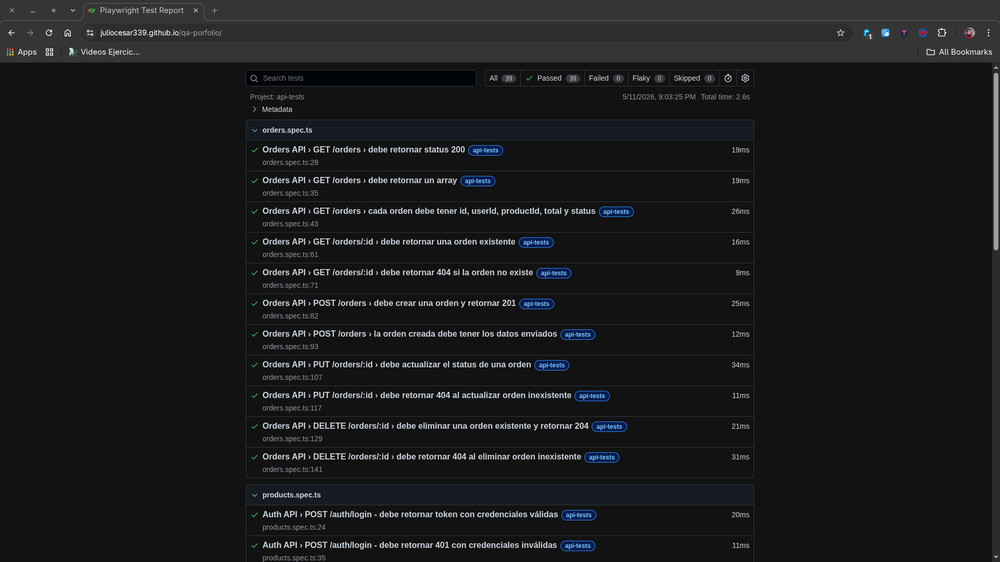
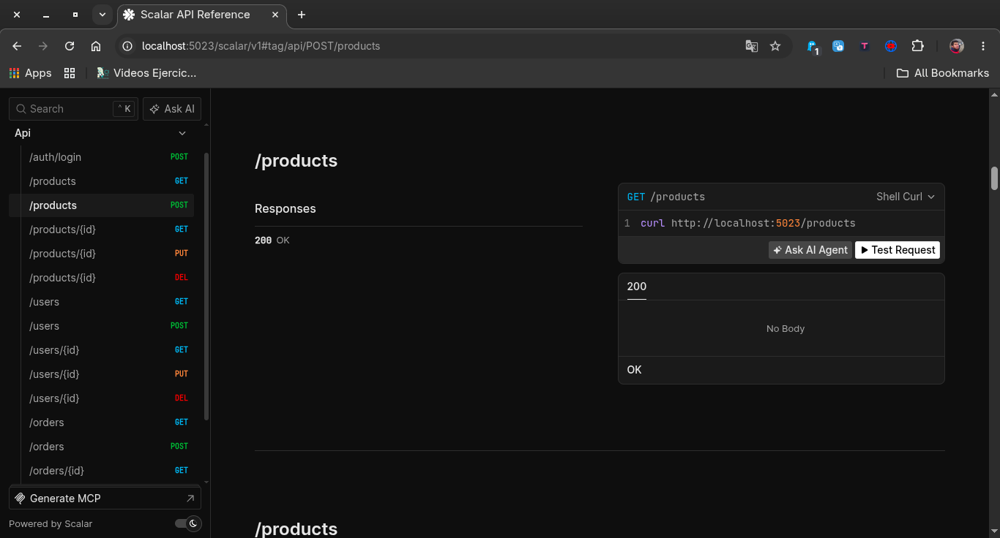
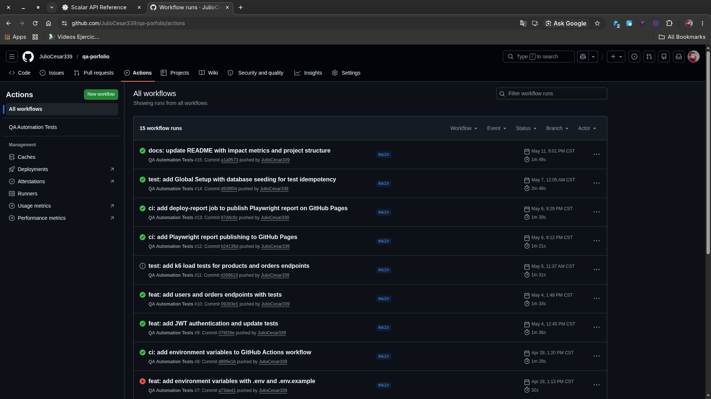
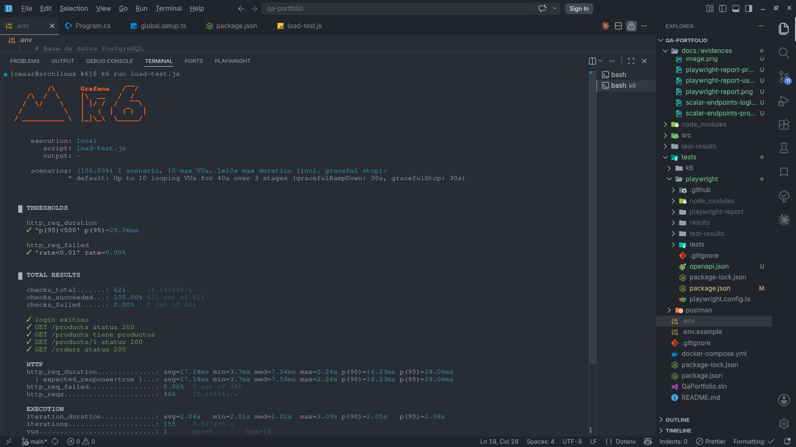

# QA Automation Portfolio

[](https://github.com/JulioCesar339/qa-porfolio/actions/workflows/playwright.yml)

> Suite completa de automatización QA sobre una API REST con autenticación JWT, base de datos PostgreSQL y pipeline CI/CD. Diseñada para demostrar prácticas profesionales de testing en un entorno real.

---
## 📸 Evidencias

### Reporte de Playwright — 39 tests en verde


### Endpoints documentados con Scalar


### GitHub Actions CI/CD en verde


### Resultados de carga con k6


---
## 🎯 Problemas que resuelve

| Problema | Solución implementada |
|----------|-----------------------|
| Tests frágiles por datos inconsistentes | Global Setup con seeding que resetea la BD antes de cada suite |
| Feedback lento en el ciclo de desarrollo | 39 tests funcionales ejecutados en < 3 segundos en CI/CD |
| Falta de visibilidad en los resultados | Reporte HTML publicado automáticamente en GitHub Pages |
| Endpoints sin protección | Autenticación JWT en todos los endpoints |
| Entorno difícil de reproducir | Un solo comando `docker compose up` levanta todo |

---

## 📊 Métricas del proyecto

| Métrica | Valor |
|---------|-------|
| Tests funcionales | 39 |
| Tiempo de ejecución | < 3 segundos |
| Cobertura de endpoints | 15 endpoints |
| Tasa de error bajo carga | 0% con 100 usuarios simultáneos |
| Requests procesados | 25,580 requests en 2min 20s |
| Tasa de requests | 180 req/s promedio — pico 323 req/s |
| P95 response time | 56ms |
| Pipeline CI/CD | Automático en cada push |

---

## 🛠️ Tecnologías

| Tecnología | Uso |
|------------|-----|
| .NET 9 Minimal API | API REST con 15 endpoints CRUD |
| PostgreSQL + Entity Framework | Base de datos con migraciones automáticas |
| Playwright + TypeScript | 39 tests funcionales automatizados |
| k6 | Tests de carga y performance |
| Docker + docker-compose | Contenedorización del entorno completo |
| GitHub Actions | CI/CD — build, test y deploy automático |
| JWT | Autenticación en todos los endpoints |

---

## 🗂️ Estructura del proyecto

```
qa-portfolio/
├── src/Api/                  ← API REST en .NET 9
│   ├── Models/               ← Product, User, Order
│   ├── Data/                 ← AppDbContext + migraciones
│   └── Program.cs            ← Endpoints + JWT + configuración
├── tests/
│   ├── playwright/           ← Suite de tests funcionales
│   │   ├── tests/
│   │   │   ├── setup/        ← Global Setup con seeding
│   │   │   ├── products.spec.ts
│   │   │   ├── users.spec.ts
│   │   │   └── orders.spec.ts
│   │   └── playwright.config.ts
│   ├── k6/                   ← Tests de carga
│   │   └── load-test.js
│   └── postman/              ← Colección Postman
│       └── products-collection.json
├── docker-compose.yml        ← Orquestación de servicios
├── .env.example              ← Plantilla de variables de entorno
└── .github/
    └── workflows/
        └── playwright.yml    ← Pipeline CI/CD
```
## 🚀 Cómo correr el proyecto

### Requisitos
- Git
- Docker + Docker Compose
- Node.js 18+

### 1. Clonar el repositorio
```bash
git clone https://github.com/JulioCesar339/qa-porfolio.git
cd qa-porfolio
```

### 2. Configurar variables de entorno
```bash
cp .env.example .env
# Edita .env con tus valores
```

### 3. Levantar la API y base de datos
```bash
docker compose up
```
API disponible en: `http://localhost:5023`
Documentación interactiva: `http://localhost:5023/scalar/v1`

### 4. Correr los tests funcionales
```bash
cd tests/playwright
npm install
npx playwright install chromium
npx playwright test
```

### 5. Ver el reporte
```bash
npx playwright show-report
```
O visita el reporte público en: **[GitHub Pages](https://juliocesar339.github.io/qa-porfolio/)**

### 6. Correr tests de carga
```bash
cd tests/k6
k6 run load-test.js
```

---

## 🔐 Autenticación

Todos los endpoints están protegidos con JWT. Para obtener un token:

```bash
curl -X POST http://localhost:5023/auth/login \
  -H "Content-Type: application/json" \
  -d '{"username":"admin","password":"admin123"}'
```

Usa el token en cada petición:
```bash
curl http://localhost:5023/products \
  -H "Authorization: Bearer <token>"
```

---

## 📋 Endpoints

| Método | Ruta | Descripción |
|--------|------|-------------|
| POST | /auth/login | Obtiene token JWT |
| GET | /products | Lista productos |
| GET | /products/{id} | Obtiene un producto |
| POST | /products | Crea un producto |
| PUT | /products/{id} | Actualiza un producto |
| DELETE | /products/{id} | Elimina un producto |
| GET | /users | Lista usuarios |
| GET | /users/{id} | Obtiene un usuario |
| POST | /users | Crea un usuario |
| PUT | /users/{id} | Actualiza un usuario |
| DELETE | /users/{id} | Elimina un usuario |
| GET | /orders | Lista órdenes |
| GET | /orders/{id} | Obtiene una orden |
| POST | /orders | Crea una orden |
| PUT | /orders/{id} | Actualiza una orden |
| DELETE | /orders/{id} | Elimina una orden |

---

## 🧪 Estrategia de pruebas

- **Idempotencia garantizada** — Global Setup resetea y semilla la BD antes de cada suite
- **Casos positivos y negativos** — cada endpoint tiene tests de éxito y error
- **Aislamiento de datos** — los tests no dependen de IDs fijos sino de datos dinámicos
- **Performance** — k6 simula 10 usuarios simultáneos con 0% de errores y 21ms promedio
- **CI/CD** — cada push ejecuta la suite completa y publica el reporte automáticamente

---

*Desarrollado por Julio César Cabrera Hernández — [GitHub](https://github.com/JulioCesar339)*